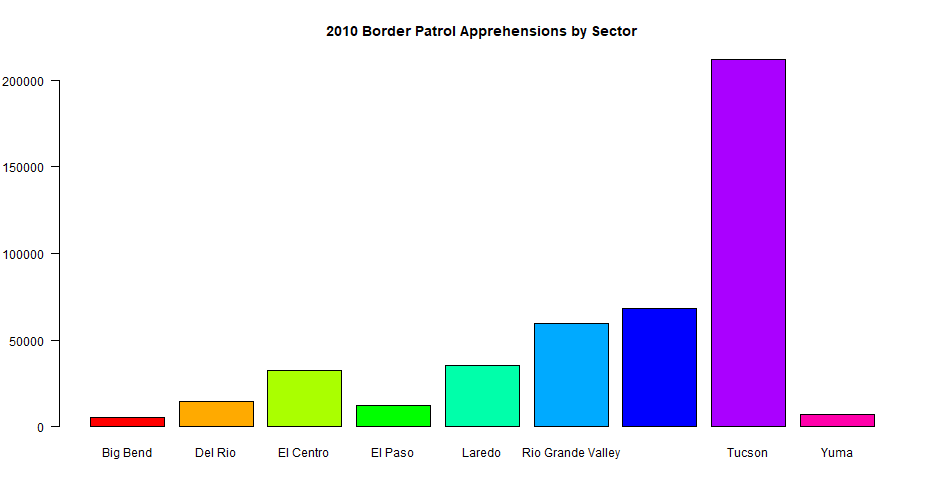
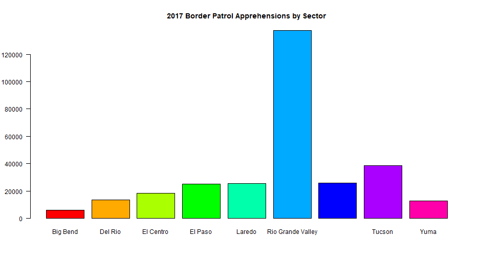
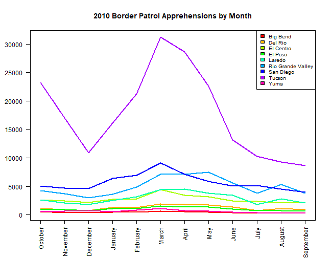
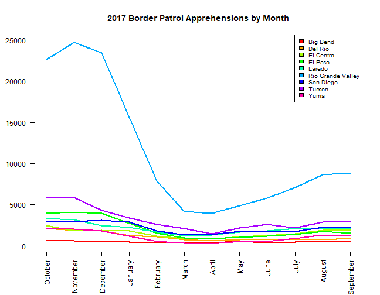
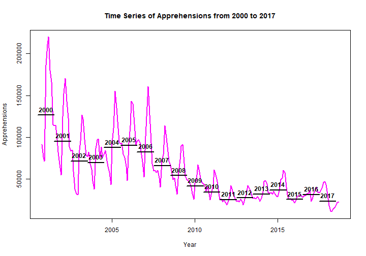

Assignment 3 Presentation
========================================================
author: Natalya Shelchkova
date: February 16, 2018
autosize: true

Present Day 
========================================================

[According to CNN, US-Mexico border apprehensions hit a 17-year low.](https://www.cnn.com/2017/05/09/politics/border-crossings-apprehensions-down-trump/index.html) However, its important to look at the data in order to analyze trends, thus we will look at:

- The number of apprehensions per sector and analyzing whether there was a significant decrease in those values.
- Looking at the overall pattern of apprehensions throughout the year per sector.

- Looking at the total number of apprehensions from 2010 to 2017.


Apprehensions by Sector
========================================================
Looking at the number of apprehensions by Sector from 2010 to 2017 we see that the number of apprehensions in Tucson decreased from 2010 to 2017 however the number of apprehensions in Rio Grande Valley has increased. 


Apprehensions by Sector
========================================================

Apprehensions by Sector
========================================================
The maximum number of total apprehensions however, has not decreased significantly

```

	Welch Two Sample t-test

data:  BP_2010[max_app_idx_2010, 1:12] and BP_2017[max_app_idx_2017, 1:12]
t = 1.9547, df = 21.973, p-value = 0.06346
alternative hypothesis: true difference in means is not equal to 0
95 percent confidence interval:
  -379.5935 12819.5935
sample estimates:
mean of x mean of y 
  17683.5   11463.5 
```

Apprehensions by Month
========================================================
In 2010, the most apprehensions occured in the months March - May, while in 2010 the most apprehensions occured during October - December.
 

Apprehensions by Month
========================================================

Apprehensions by Month
========================================================
However again, this difference is not significant.


```

	Welch Two Sample t-test

data:  BP_2010[1:9, max_app_month_2010] and BP_2017[1:9, max_app_month_2017]
t = 0.48741, df = 50.321, p-value = 0.6281
alternative hypothesis: true difference in means is not equal to 0
95 percent confidence interval:
 -3119.921  5119.699
sample estimates:
mean of x mean of y 
 6060.852  5060.963 
```

Time Series/Summary
========================================================

Data shows that the number of apprehensions has steadily decreased since 2000 with 2017 reaching a new minimum.


